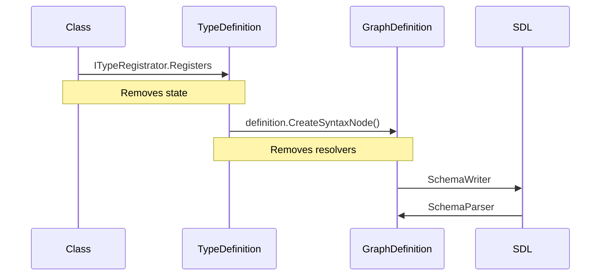

```mermaid
sequenceDiagram
    participant Class
    participant TypeDefinition
    participant GraphDefinition
    participant SDL

    Class->>TypeDefinition: ITypeRegistrator.Registers
    Note over Class,TypeDefinition: Removes state

    TypeDefinition->>GraphDefinition: definition.CreateSyntaxNode()
    Note over TypeDefinition,GraphDefinition: Removes resolvers

    GraphDefinition->>SDL: SchemaWriter
    SDL->>GraphDefinition: SchemaParser
```